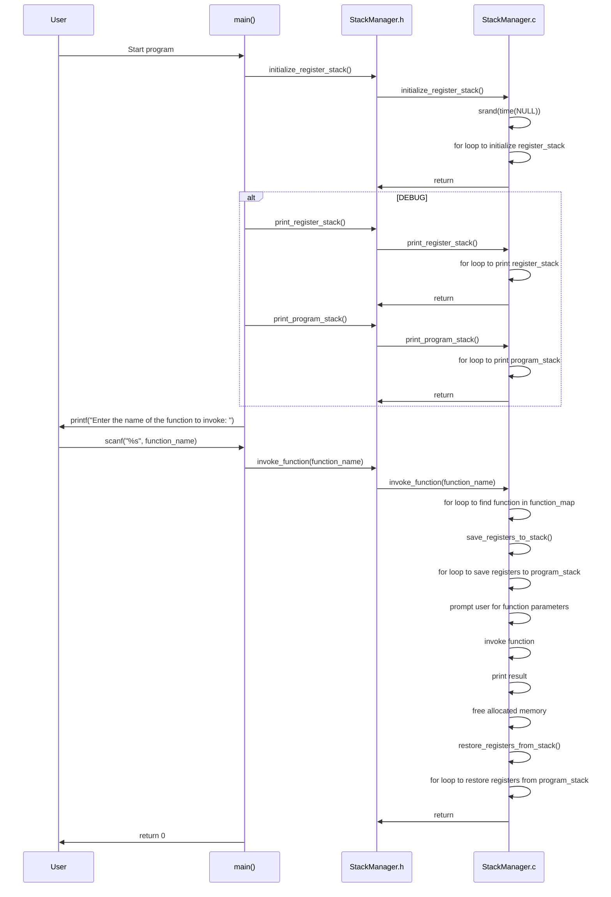

# StackManager

```mermaid
sequenceDiagram
    participant User
    participant Main as main()
    participant StackManager as StackManager.h
    participant SM as StackManager.c

    User ->> Main: Start program
    Main ->> StackManager: initialize_register_stack()
    StackManager ->> SM: initialize_register_stack()
    SM ->> SM: srand(time(NULL))
    SM ->> SM: for loop to initialize register_stack
    SM ->> StackManager: return

    alt DEBUG
        Main ->> StackManager: print_register_stack()
        StackManager ->> SM: print_register_stack()
        SM ->> SM: for loop to print register_stack
        SM ->> StackManager: return

        Main ->> StackManager: print_program_stack()
        StackManager ->> SM: print_program_stack()
        SM ->> SM: for loop to print program_stack
        SM ->> StackManager: return
    end

    Main ->> User: printf("Enter the name of the function to invoke: ")
    User ->> Main: scanf("%s", function_name)
    Main ->> StackManager: invoke_function(function_name)
    StackManager ->> SM: invoke_function(function_name)
    SM ->> SM: for loop to find function in function_map
    SM ->> SM: save_registers_to_stack()
    SM ->> SM: for loop to save registers to program_stack
    SM ->> SM: prompt user for function parameters
    SM ->> SM: invoke function
    SM ->> SM: print result
    SM ->> SM: free allocated memory
    SM ->> SM: restore_registers_from_stack()
    SM ->> SM: for loop to restore registers from program_stack
    SM ->> StackManager: return

    Main ->> User: return 0
```